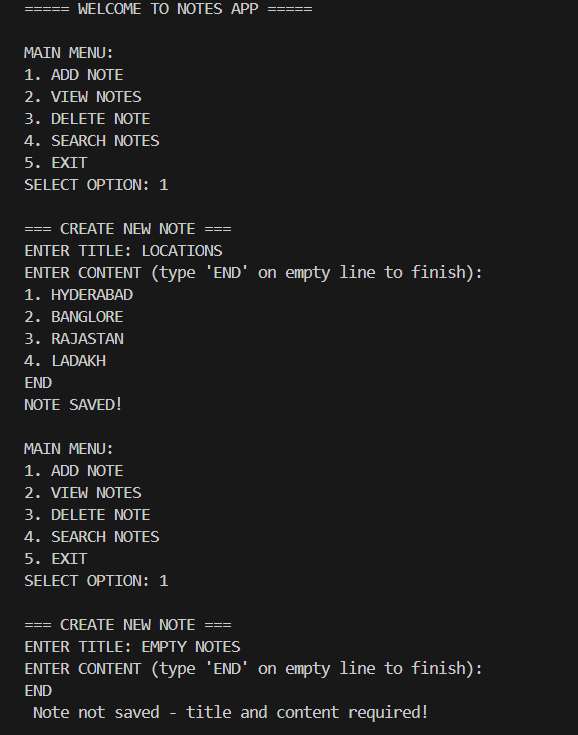
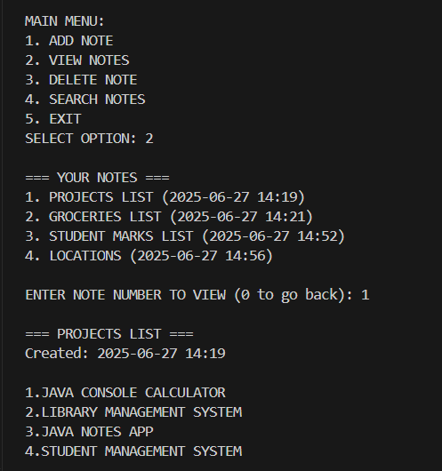
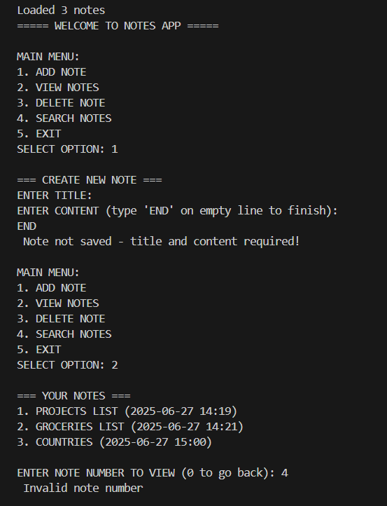
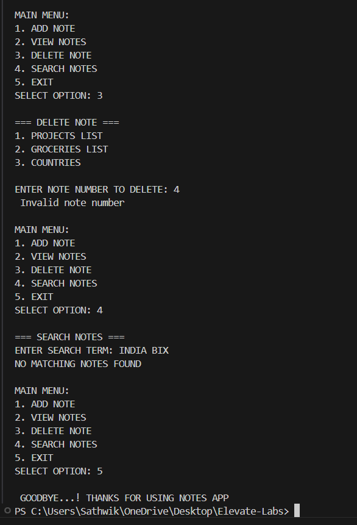
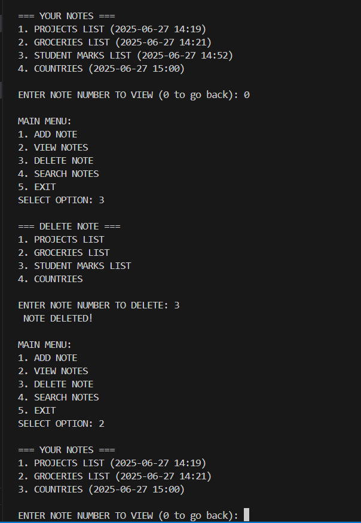
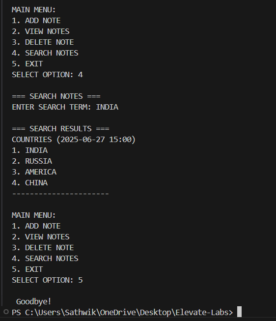

# JAVA-NOTES-APP
A simple console-based Notes Manager built in Java. This app allows users to create, view, delete, and search notes, all stored using file I/O operations.

## 📌 Features
➕ Add and save notes with a title and multi-line content

📋 View all notes with timestamps

🗑️ Delete selected notes

🔍 Search notes by title or content

💾 Notes are stored in a notes.txt file using BufferedReader and BufferedWriter

## 🛠️ Technologies Used
Java 17+

Console (Terminal / Command Prompt)

File I/O: BufferedReader, BufferedWriter, FileReader, FileWriter

Exception Handling

### 🔑 Key Highlights:
- 📁 File-based storage (`notes.txt`) using `BufferedReader` and `BufferedWriter`
- 🧱 Modular code with separation of concerns across multiple classes
- 👨‍💻 Beginner-friendly console interface
- 🔎 Search functionality across both title and content

## ▶️ How to Run

Compile the code:

javac src/*.java

Run the program:

java -cp src MainApp

🔁 The program will auto-create notes.txt when saving notes.

# 📸 Application Outcomes

## Main Interface Flows

| Screenshot | Description |
|------------|-------------|
|  | **Main Menu**  - First screen users encounter - Clean numbered options (1-5) - Handles invalid inputs - Clear exit option |
|  | **Successful Note Creation**  - Multi-line input support - 'END' command terminates input - Auto-generates timestamp - Success confirmation message |

## Validation & Error Handling

| Screenshot | Description |
|------------|-------------|
|  | **Input Validation**  - Rejects empty titles/content - Clear error message - Returns to main menu - Preserves other notes |
|  | **Delete Protection**  - Prevents invalid note selection - Maintains data integrity - Clear error feedback - Numbered list remains stable |

## Core Features

| Screenshot | Description |
|------------|-------------|
|  | **Note Management**  - Lists all notes with IDs - Shows creation timestamps - Detailed content view - '0' to go back |
|  | **Search Functionality**  - Case-insensitive search - Highlights matches - Full-note display - Clear section divider |

---

## ✅ Learning Outcomes
📁 Working with Java file I/O

📚 Exception handling and input validation

🧠 Structuring a Java application with multiple classes

🎯 Organizing files and folders for real-world projects

## Description

## 📝 Java Notes App – File I/O Project

The **Java Notes App** is a console-based application that allows users to **create**, **view**, **delete**, and **search** personal notes. Each note consists of a title, timestamp, and multi-line content. All notes are stored persistently in a `notes.txt` file using **Java File I/O** (`BufferedReader`, `BufferedWriter`, `FileReader`, `FileWriter`).

It simulates real-world text-based note-taking and serves as a great introduction to working with files in Java, especially for beginners exploring object-oriented programming and persistent storage techniques.

---

